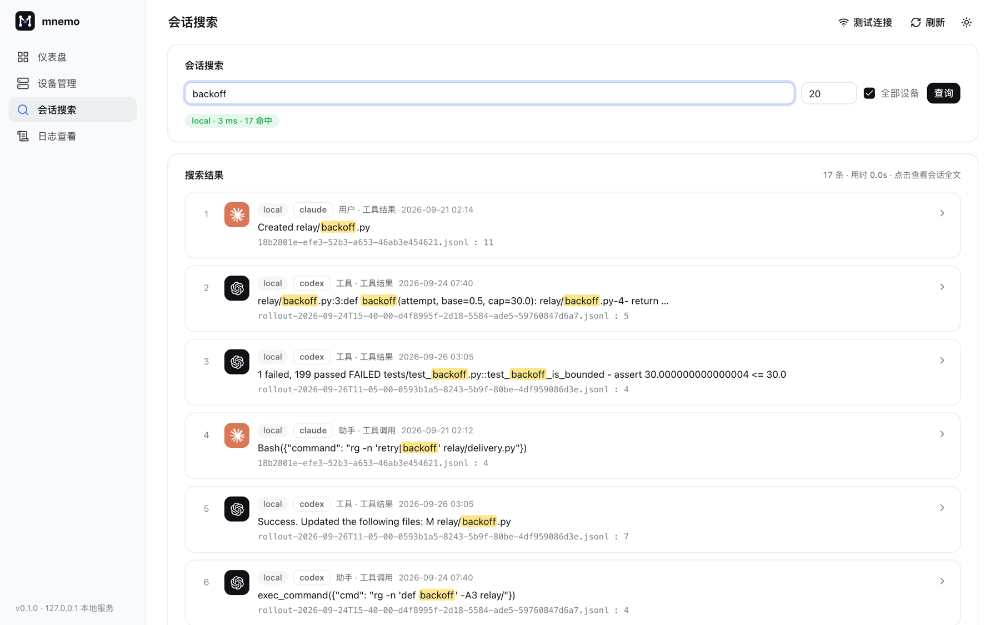
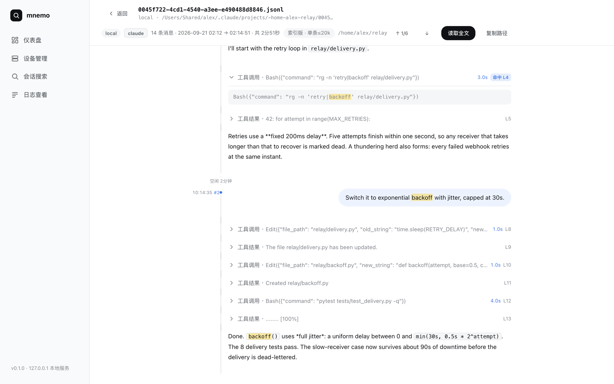
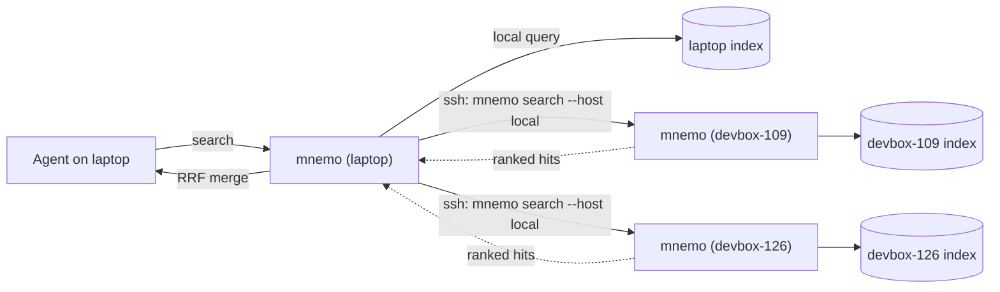

<div align="center">

<picture>
  <source media="(prefers-color-scheme: dark)" srcset="docs/assets/logo-dark.svg">
  
</picture>

# Mnemo

**One memory for all your coding agents.**

Your agents can recall every Claude Code, Codex and Pi session you've ever run, on this machine and your devboxes, just by asking.

[](#install)
[](#install)
[](docs/architecture.md)
[](docs/agent-tools.md)
[](LICENSE)

**[Website](https://szupzj18.github.io/mnemo/)** · [Docs](docs/getting-started.md) · [Changelog](CHANGELOG.md)

English · [简体中文](README.zh-CN.md)

</div>

```text
you ▸ test_backoff_is_bounded is failing again. Didn't we fix this before?

claude ▸ search_sessions(query="backoff flaky")
         1 hit · codex · devbox-126 · 2026-09-26 · /home/alex/relay
           "CI is red on main: test_[[backoff]]_is_bounded is [[flaky]]. Investigate."

       ▸ get_context(path=…/rollout-2026-09-26….jsonl, line=2, host="devbox-126")
           tool  1 failed, 199 passed … assert 30.000000000000004 <= 30.0
           codex A floating-point edge case … I'll clamp explicitly in backoff()
           codex apply_patch: return min(cap, random.uniform(0, base * 2 ** attempt))

claude ▸ Yes. Codex fixed this on devbox-126 on Sep 26: the jittered delay could
         exceed the 30s cap by float error, so the clamp moved after the jitter.
         That fix isn't on this branch. Want me to apply the same patch?
```

<sub>Illustrative session with trimmed output. See <a href="#the-recall-loop">the recall loop</a> for what each call returns.</sub>

## Why Mnemo

Every coding agent already writes its full working memory to disk: prompts, reasoning, tool calls, tool output. But each agent keeps its own logs, and each machine keeps its own. The result is a set of islands:

- Claude Code can't see what you worked out in Codex yesterday.
- The agent on your laptop can't see last week's session on the devbox.
- Handoff notes and shared `MEMORY.md` files only help if every agent keeps them up to date, and they don't.

Mnemo indexes the logs your agents **already produce** and gives every agent the same tools to search and read them. Your agents don't have to change how they work, and you don't write any notes.

## How agents use Mnemo

### Just ask

With the MCP server and the skill installed, you don't have to name the tool. Questions like these send the agent to its history:

| You say | The agent |
|---|---|
| "How did we fix the OOM on the GPU box last week?" | Searches all devices, then reads the fix in context |
| "Did Codex ever try sqlite-vec for this?" | Searches `source=codex`, then summarizes what was tried and why it was dropped |
| "Pick up where the devbox session left off yesterday." | Finds the session and reads its tail with `get_session(tail=…)` |
| "What was the exact command we used to rebuild the index?" | Searches `kind=tool_call` and quotes the command verbatim |
| "上次那个 Kerberos 报错是怎么解决的？" | Chinese matches by substring, so `Kerberos 报错` works too |

### The recall loop

Every lookup follows the same three steps, and each step reads more than the one before it. The agent stops as soon as it has what it needs, so it pays only for that:

```text
search_sessions ──▶ get_context ──▶ get_session
 ~1.6k–3.3k tokens   a few k tokens     only when the whole arc matters
 "where is it?"      "what happened?"   "walk me through it"
```

1. **`search_sessions`** returns ranked hits. Each hit carries `host`, `source`, `cwd`, `ts`, `role`, `kind`, a snippet with the matched terms marked, and `path` + `lineno`. Keywords are ANDed, and filters narrow by agent, device, directory, date or message kind.
2. **`get_context`** reads the messages around a hit: the prompt that led up to it, the tool calls and results, and the conclusion. The agent passes back the hit's `host`, and the read runs on that device.
3. **`get_session`** reads the whole session. `head`/`tail` skim a long one, and `raw: true` reads the original JSONL when an indexed body was truncated at 20k characters.

Snippets are deliberately short. The skill tells the agent to call `get_context` before quoting or reusing anything from a hit.

### Tools

| MCP | Pi | CLI | Purpose |
|---|---|---|---|
| `search_sessions` | `search_sessions` | `mnemo search … --json` | Ranked keyword search across all agents and devices |
| `get_context` | `get_session_context` | `mnemo context <path> <line>` | Messages around a hit |
| `get_session` | `get_full_session` | `mnemo session <path>` | The whole session, optionally head/tail/raw |
| `list_recent_sessions` | — | `mnemo recent` | Recently started sessions with their first task as title |
| `reindex` | — | `mnemo index` | Incremental sync of local logs |

Parameters, output shapes and token costs: [Agent tools](docs/agent-tools.md).

### Make it a habit

The skill covers "look it up when the user asks." To have agents check history *before* they start work, add a rule to your `AGENTS.md` or `CLAUDE.md`:

```markdown
## Past sessions
Before non-trivial work, and whenever I refer to earlier work ("last time", "like before",
"did we ever…"), search past agent sessions with mnemo (`search_sessions`, or
`mnemo search … --json`). Read promising hits with `get_context` before relying on them,
and say which session (agent, device, date) you are drawing on.
```

## Highlights

- **Cross-agent.** A single index covers Claude Code, Codex (including archived sessions) and Pi, all normalized to one message schema.
- **Cross-device.** Queries fan out over SSH to your devboxes and merge by rank. Session bodies never leave the machine that produced them.
- **Cheap for agents.** A search returns ranked snippets, not raw logs: ~1.6k tokens for 10 hits. In a controlled test, agents used 23% fewer tokens and 52% fewer tool calls than with grep ([benchmarks](#benchmarks)).
- **Good at CJK.** English uses prefix matching and Chinese uses substring matching (unigram + bigram), all ranked with BM25.
- **Fast and small.** Searches take about 50–100 ms, an idle incremental sync about 0.1 s, and the index is ~22% of raw log size.
- **Zero dependencies.** Mnemo needs only the Python 3.7+ standard library and SQLite FTS5. It installs with `git clone` and needs no daemon.
- **A dashboard for humans.** A local browser UI to search, read sessions on a timeline and manage devices.

## Install

```bash
curl -fsSL https://szupzj18.github.io/mnemo/install.sh | sh
```

One command: it checks Python 3.7+ and SQLite FTS5, clones to `~/mnemo`, links `mnemo` into `~/.local/bin`, builds the index, and runs `mnemo setup`, which connects every agent it finds (Claude Code MCP + skill, Codex MCP, Pi extension; anything already configured is left alone). Run it again to upgrade. Prefer a Python tool manager? `uv tool install git+https://github.com/szupzj18/mnemo && mnemo setup` (or `pipx install`).

Then try `mnemo search "retry budget"`, or ask an agent about something only an old session would know.

<details>
<summary><b>Manual install</b></summary>

```bash
git clone https://github.com/szupzj18/mnemo.git ~/mnemo
ln -s ~/mnemo/bin/mnemo ~/.local/bin/mnemo    # any directory on PATH
mnemo index                                   # first full index; later runs are incremental
mnemo setup                                   # connect agents (or configure them by hand below)
```
</details>

To connect agents by hand:

<details open>
<summary><b>Claude Code</b></summary>

```bash
claude mcp add --scope user mnemo -- mnemo mcp
```

For better triggering, also install the skill. It tells the agent *when* to reach for past sessions:

```bash
ln -s ~/mnemo/integrations/skills/mnemo ~/.claude/skills/mnemo
```
</details>

<details>
<summary><b>Codex</b></summary>

`~/.codex/config.toml`:

```toml
[mcp_servers.mnemo]
command = "/Users/you/.local/bin/mnemo"   # absolute path
args = ["mcp"]
startup_timeout_sec = 120
```
</details>

<details>
<summary><b>Pi</b></summary>

```bash
ln -s ~/mnemo/integrations/pi/mnemo.ts ~/.pi/agent/extensions/mnemo.ts
```

The extension calls the `mnemo` CLI. It looks for `~/mnemo/bin/mnemo` first, then `PATH`, and `MNEMO_BIN` overrides both.
</details>

<details>
<summary><b>Any other MCP client</b></summary>

Register the stdio command `mnemo mcp`. For agents that support skills but not MCP, symlink `integrations/skills/mnemo/` into their skills directory. The skill uses the CLI.
</details>

See [Getting started](docs/getting-started.md) for keeping the index fresh and troubleshooting.

## Dashboard

For you rather than your agents: `mnemo dashboard` opens a local web UI (`127.0.0.1`, token-gated) with the same search, across every device.

<picture>
  <source media="(prefers-color-scheme: dark)" srcset="docs/assets/search-dark.png">
  
</picture>

Click a hit to open the full session as a chat thread. Matches are highlighted and you can jump between them. Tool calls fold away. A timeline rail marks each turn, idle gaps, day changes and how long each tool call took.

<picture>
  <source media="(prefers-color-scheme: dark)" srcset="docs/assets/session-dark.png">
  
</picture>

The dashboard also covers index stats, per-device health, device add/update/remove and search diagnostics (latency and hits per device). It has light and dark themes.

## Multiple machines

```bash
mnemo remote add devbox-126          # rsync-installs mnemo over SSH and builds its index
mnemo search "sglang oom"            # now searches local + devbox-126 in parallel
```



The design is **message passing, not shared storage**. Each machine indexes only its own logs, a search is a message sent to every device, and results come back as ranked hits merged with Reciprocal Rank Fusion. `context` and `session` reads are routed to the device that holds the session, so no central database collects everyone's transcripts. To form a mesh, run `remote add` on each machine. Unreachable devices are skipped with a warning.

Details: [Multi-device](docs/multi-device.md).

## Benchmarks

Measured on a real corpus of 730 sessions and 149,678 messages (3.6 GB of logs):

| | |
|---|---|
| Full index build | 28.9 s (one-time) |
| Incremental sync, nothing changed | 0.07–0.13 s |
| Search (CLI end-to-end) | 46–106 ms |
| `context` lookup, largest session | 7 ms (vs 316 ms re-parsing JSONL) |
| Index size | 784 MB (21.8% of raw) |

In a controlled experiment, fresh agents answered four "what did we do back then" questions, once with Mnemo and once with only `grep`/`rg` over the raw logs. Both groups got every answer right. With Mnemo they used **23% fewer tokens, 52% fewer tool calls and 40% less wall time**. The gain grows with the size of the search space. When the answer sat in a small, guessable directory, plain grep was just as good. Methodology and caveats: [Benchmarks](docs/benchmarks.md).

## Privacy & security

- Everything runs locally. Mnemo makes no network calls except SSH to devices you registered yourself.
- Session bodies are read on the device that produced them. A cross-device query returns only the hits and the messages you asked to read.
- The dashboard listens on `127.0.0.1` only. API calls require a random per-launch token and a local `Host` header.
- The index at `~/.mnemo/index.db` holds your transcripts in plaintext. Treat it like the logs themselves.

See [SECURITY.md](SECURITY.md) to report a vulnerability.

## Documentation

| | |
|---|---|
| [Getting started](docs/getting-started.md) | Install, connect each agent, keep the index fresh |
| [Agent tools](docs/agent-tools.md) | MCP / Pi tool schemas and the search → context → session workflow |
| [CLI reference](docs/cli.md) | Every command and flag |
| [Multi-device](docs/multi-device.md) | Remotes, mesh setup, SSH and Kerberos notes |
| [Architecture](docs/architecture.md) | Index schema, CJK matching, sync, federation |
| [Benchmarks](docs/benchmarks.md) | Latency, token cost, end-to-end experiment |

## Roadmap

- [ ] More agents: Gemini CLI (bodies live in protobuf SQLite blobs), Cursor, OpenCode
- [ ] Hybrid semantic search (`sqlite-vec` + local embeddings) alongside keyword search
- [ ] Length caps on `tool_result` in `context` responses to bound per-call token cost
- [ ] External-content FTS table with compressed bodies (~30–40% smaller index)

## Contributing

Issues and PRs are welcome, especially new agent adapters (each is about 100 lines). Start with [CONTRIBUTING.md](CONTRIBUTING.md). Coding agents working in this repo should read [AGENTS.md](AGENTS.md).

## License

[MIT](LICENSE)
