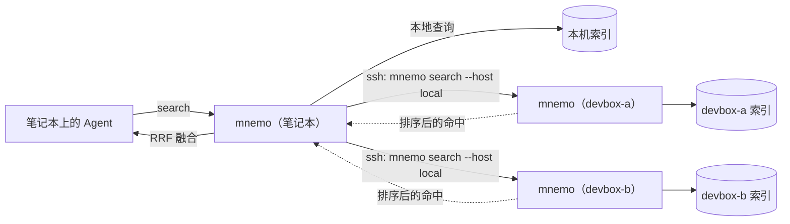

<div align="center">

<picture>
  <source media="(prefers-color-scheme: dark)" srcset="docs/assets/logo-dark.svg">
  
</picture>

# Mnemo

**所有编程 Agent 共用的一份记忆。**

让 Agent 直接回忆你在本机和 devbox 上跑过的每一个 Claude Code、Codex、OpenCode、Pi 会话，开口问就行。

[](#安装)
[](#安装)
[](docs/architecture.md)
[](docs/agent-tools.md)
[](LICENSE)

**[官网](https://szupzj18.github.io/mnemo/)** · [文档](docs/getting-started.md) · [更新日志](CHANGELOG.md)

[English](README.md) · 简体中文

</div>

```text
你     ▸ test_backoff_is_bounded 又挂了，之前是不是修过？

claude ▸ search_sessions(query="backoff flaky")
         1 条命中 · codex · devbox-b · 2026-09-26 · /home/alex/relay
           "CI is red on main: test_[[backoff]]_is_bounded is [[flaky]]. Investigate."

       ▸ get_context(path=…/rollout-2026-09-26….jsonl, line=2, host="devbox-b")
           tool  1 failed, 199 passed … assert 30.000000000000004 <= 30.0
           codex A floating-point edge case … I'll clamp explicitly in backoff()
           codex apply_patch: return min(cap, random.uniform(0, base * 2 ** attempt))

claude ▸ 修过。9 月 26 日 Codex 在 devbox-b 上处理过：加了 jitter 的延迟会因浮点误差
         略超 30s 上限，修法是把截断挪到 jitter 之后。这个修复不在当前分支上，要我照着打一遍吗？
```

<sub>示意会话，输出有删节。每一步返回什么，见下文「回忆链路」。</sub>

## 为什么需要 Mnemo

每个编程 Agent 都会把完整的工作记忆写到本地：提示词、推理、工具调用、工具输出。但日志按 Agent 分开存放，也按机器分开存放，结果是一座座孤岛：

- Claude Code 看不到你昨天在 Codex 里得出的结论。
- 笔记本上的 Agent 看不到上周在 devbox 上的会话。
- handoff 文档和共享 `MEMORY.md` 要靠每个 Agent 持续写入才有用，实际很难坚持。

Mnemo 直接索引 Agent **已经在写**的日志，并给每个 Agent 提供同一套工具来搜索和阅读这些会话。Agent 的使用方式不需要任何改变，你也不需要写笔记。

## Agent 怎么用 Mnemo

### 直接问

装好 MCP 服务和技能之后，不用点名工具。下面这类问题会让 Agent 自己去翻历史：

| 你说 | Agent 会 |
|---|---|
| "上周 GPU 机器上那个 OOM 是怎么解决的？" | 搜索所有设备，再读修复前后的上下文 |
| "Codex 有没有试过用 sqlite-vec 做这个？" | 按 `source=codex` 搜索，总结试过什么、为什么放弃 |
| "接着 devbox 上昨天那个会话继续做。" | 找到会话，用 `get_session(tail=…)` 读结尾 |
| "上次重建索引用的完整命令是什么？" | 按 `kind=tool_call` 搜索，原样引用命令 |
| "上次那个连接池超时是怎么解决的？" | 中文按子串匹配，`连接池超时` 直接能搜到 |

### 回忆链路

每次回忆都是同样的三步，一步比一步读得多。Agent 拿到需要的信息就停下，只为用到的部分付 token：

```text
search_sessions ──▶ get_context ──▶ get_session
 约 1.6k–3.3k token   几 k token        需要完整来龙去脉时才用
 "在哪？"             "发生了什么？"     "从头讲一遍"
```

1. **`search_sessions`**：返回 `{hits, coverage, warnings}`，其中覆盖信息报告设备失败、索引刷新状态和正文截断上限。每条带 `host`、`source`、`cwd`、`ts`、`role`、`kind`、标出命中词的片段，以及 `path` + `lineno`。多个关键词按 AND 组合，可以按 Agent、设备、目录、日期、消息类型过滤。
2. **`get_context`**：读命中点前后的消息：引出它的提问、中间的工具调用和结果、最后的结论。Agent 把命中的 `host` 传回来，读取就在那台设备上执行。
3. **`get_session`**：用 `limit`、`cursor`、`anchor_line` 分页读取，也支持整段读取。`head`/`tail` 只读取选中的索引正文；索引里的正文超过 20k 字符会被截断，这时用 `raw: true` 读原始 JSONL。

支持 Codex 完成事件和 `.jsonl.zst` 压缩日志。压缩读取要求持有日志的设备安装可选的 `zstd` 命令；缺少解码器时保留已有 Codex 索引并报告覆盖警告。见[分页与搜索覆盖](docs/retrieval.md)。

片段刻意做得很短。技能要求 Agent 在引用或复用命中内容之前，先调用 `get_context` 读上下文。

### 工具

| MCP | Pi | CLI | 作用 |
|---|---|---|---|
| `search_sessions` | `search_sessions` | `mnemo search … --json` | 跨所有 Agent 和设备的关键词排序检索 |
| `get_context` | `get_session_context` | `mnemo context <path> <line>` | 命中点前后的消息 |
| `get_session` | `get_full_session` | `mnemo session <path>` | 整段会话，可选 head/tail/raw |
| `list_recent_sessions` | — | `mnemo recent` | 最近开始的会话，以首个真实任务为标题 |
| `reindex` | — | `mnemo index` | 增量同步本机日志 |

参数、返回结构和 token 开销见 [Agent tools](docs/agent-tools.md)。

### 养成习惯

技能负责"用户问起时去查"。如果想让 Agent 在**动手之前**就先查历史，可以在 `AGENTS.md` 或 `CLAUDE.md` 里加一条：

```markdown
## 历史会话
开始较大的任务前，以及我提到以前的工作时（"上次""像之前那样""有没有试过"），
先用 mnemo 搜历史会话（`search_sessions`，或 `mnemo search … --json`）。
依赖某条命中之前先用 `get_context` 读上下文，并说明参考的是哪个会话（Agent、设备、日期）。
```

## 特性

- **跨 Agent**：Claude Code、Codex（含归档会话）、OpenCode、Pi 统一进一个索引，归一成同一套消息结构。
- **跨设备**：查询经 SSH 并行扇出到各台 devbox，按排名融合；会话正文不离开产生它的机器。
- **对 Agent 省 token**：搜索返回的是排序后的片段而不是原始日志，10 条命中约 1.6k token。对照实验中，Agent 比用 grep 少用 23% 的 token、少调用 52% 的工具（见[评测](#评测)）。
- **中英文都能搜**：英文前缀匹配，中文子串匹配（unigram + bigram），BM25 排序。
- **快且小**：搜索约 50–100 ms，空闲增量同步约 0.1 s，索引约为原始日志的 22%。
- **零依赖**：只需要 Python 3.7+ 标准库和 SQLite FTS5，`git clone` 即可用，不需要常驻进程。
- **给人用的面板**：本地浏览器界面，可以搜索、按时间轴读会话、管理设备。

## 安装

```bash
curl -fsSL https://szupzj18.github.io/mnemo/install.sh | sh
```

一条命令完成：检查 Python 3.7+ 和 SQLite FTS5，克隆到 `~/mnemo`，把 `mnemo` 链进 `~/.local/bin`，建索引，再运行 `mnemo setup` 自动接好本机检测到的 Agent（Claude Code 的 MCP 和技能、Codex 的 MCP、OpenCode 的 MCP、Pi 扩展；已配置的不会重复改动）。再运行一次即升级。习惯用 Python 工具管理器的话：`uv tool install mnemo-search && mnemo setup`（或 `pipx install mnemo-search`；装好后命令是 `mnemo`）。

装好后试试 `mnemo search "retry budget"`，或者问 Agent 一个只有旧会话才知道答案的问题。

<details>
<summary><b>手动安装</b></summary>

```bash
git clone https://github.com/szupzj18/mnemo.git ~/mnemo
ln -s ~/mnemo/bin/mnemo ~/.local/bin/mnemo    # 任意 PATH 目录
mnemo index                                   # 首次全量，之后增量
mnemo setup                                   # 接入 Agent（也可以按下面的方式手动配置）
```
</details>

手动接入 Agent：

<details open>
<summary><b>Claude Code</b></summary>

```bash
claude mcp add --scope user mnemo -- mnemo mcp
ln -s ~/mnemo/integrations/skills/mnemo ~/.claude/skills/mnemo   # 技能：告诉 Agent 何时该去翻历史
```
</details>

<details>
<summary><b>Codex</b></summary>

`~/.codex/config.toml`：

```toml
[mcp_servers.mnemo]
command = "/Users/you/.local/bin/mnemo"   # 用绝对路径
args = ["mcp"]
startup_timeout_sec = 120
```
</details>

<details>
<summary><b>Pi</b></summary>

```bash
ln -s ~/mnemo/integrations/pi/mnemo.ts ~/.pi/agent/extensions/mnemo.ts
```

扩展调用 `mnemo` CLI，先找 `~/mnemo/bin/mnemo`，再找 `PATH`；可以用 `MNEMO_BIN` 覆盖。
</details>

<details>
<summary><b>其他 MCP 客户端</b></summary>

注册 stdio 命令 `mnemo mcp` 即可。只支持技能、不支持 MCP 的 Agent，把 `integrations/skills/mnemo/` 软链进它的技能目录。
</details>

保持索引新鲜、排障等内容见 [Getting started](docs/getting-started.md)。

## 面板

面板是给人用的：`mnemo dashboard` 打开本地 Web 界面（只监听 `127.0.0.1`，需要 token），在浏览器里做同样的跨设备搜索。

<picture>
  <source media="(prefers-color-scheme: dark)" srcset="docs/assets/search-dark.png">
  
</picture>

点开任意命中，会按聊天线程渲染整段会话：命中词高亮，可以在命中之间逐条跳转，工具块可以折叠。左侧时间轨标出每一轮对话、空闲间隔、跨天分隔和每次工具调用的耗时。

<picture>
  <source media="(prefers-color-scheme: dark)" srcset="docs/assets/session-dark.png">
  
</picture>

面板还提供索引统计、各设备健康状态、设备增删和更新、经中转可达的全部设备的拓扑图、搜索诊断（每台设备的耗时与命中数），支持浅色和深色主题。

## 多台机器

```bash
mnemo remote add devbox-b          # 经 SSH 用 rsync 安装并构建远端索引
mnemo search "sglang oom"            # 之后同时搜本机和 devbox-b
```



核心理念是**以通信共享记忆，而不是建共享存储**。每台机器只索引自己的日志；一次搜索就是发给各设备的一条消息，返回的排序命中用 Reciprocal Rank Fusion 融合。`context` 和 `session` 的读取路由到持有该会话的设备执行，不存在收集所有人会话的中心库。每台设备只需登记直连的邻居；在某台设备上执行 `mnemo node --forward on`，搜索就能经它中转到更远的设备，链式、树形、网状拓扑都可以，环路和重复结果会自动处理。命中会带上路由，例如 `devbox-a/devbox-b`。不可达的设备会被跳过并给出警告。

详见 [Multi-device](docs/multi-device.md)。

## 评测

真实语料：730 个会话、149,678 条消息、3.6 GB 原始日志。

| | |
|---|---|
| 全量建索引 | 28.9 s（一次性） |
| 无变化时增量同步 | 0.07–0.13 s |
| 搜索（CLI 端到端） | 46–106 ms |
| 最大会话的 `context` 读取 | 7 ms（重新解析 JSONL 需 316 ms） |
| 索引体积 | 784 MB（原始日志的 21.8%） |

对照实验：让新开的 Agent 回答 4 个"以前是怎么做的"问题，一组用 Mnemo，一组只能对原始日志用 `grep`/`rg`。两组全部答对；Mnemo 组 **token 少 23%、工具调用少 52%、耗时少 40%**。搜索范围越大收益越明显；答案在一个小而路径好猜的目录里时，直接 grep 同样高效。方法与局限见 [Benchmarks](docs/benchmarks.md)。

## 隐私与安全

- 全部在本地运行；除了 SSH 到你自己注册的设备，没有任何网络请求。
- 会话正文在产生它的设备上读取；跨设备查询只返回命中结果和你明确要读的消息。
- 面板只监听 `127.0.0.1`，API 需要每次启动随机生成的 token，并校验 `Host` 头。
- `~/.mnemo/index.db` 以明文保存会话内容，请像对待原始日志一样对待它。

漏洞报告见 [SECURITY.md](SECURITY.md)。

## 文档

| | |
|---|---|
| [Getting started](docs/getting-started.md) | 安装、接入各 Agent、保持索引新鲜 |
| [Agent tools](docs/agent-tools.md) | MCP / Pi 工具定义与"搜索 → 上下文 → 全文"用法 |
| [CLI reference](docs/cli.md) | 全部命令与参数 |
| [Multi-device](docs/multi-device.md) | 远程设备、组网、SSH 与 Kerberos |
| [Architecture](docs/architecture.md) | 索引结构、中文匹配、增量同步、联邦搜索 |
| [Benchmarks](docs/benchmarks.md) | 延迟、token 开销、端到端实验 |

## 路线图

- [ ] 更多 Agent：Gemini CLI（正文存在 protobuf SQLite blob 中）、Cursor
- [ ] 语义检索（`sqlite-vec` + 本地 embedding）与关键词检索混合
- [ ] `context` 返回的 `tool_result` 加长度上限，控制单次 token 上界
- [ ] external-content FTS 表 + 正文压缩（索引预计小 30–40%）

## 参与贡献

欢迎提 Issue 和 PR，尤其是新的 Agent 适配器（每个约 100 行）。先读 [CONTRIBUTING.md](CONTRIBUTING.md)；在本仓库工作的编程 Agent 请读 [AGENTS.md](AGENTS.md)。

## 许可证

[MIT](LICENSE)
