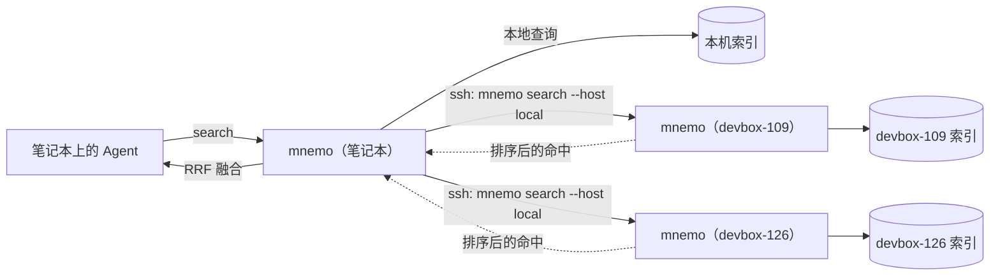

<div align="center">

# Mnemo

**所有编程 Agent 共用的一份记忆。**

在任意一个 Agent 里，搜索你在本机和远程开发机上跑过的全部 Claude Code、Codex、Pi 会话。

[](#安装)
[](#安装)
[](docs/architecture.md)
[](docs/agent-tools.md)
[](LICENSE)

[English](README.md) · 简体中文

<picture>
  <source media="(prefers-color-scheme: dark)" srcset="docs/assets/search-dark.png">
  
</picture>

</div>

## 为什么需要 Mnemo

每个编程 Agent 都会把完整的工作记忆写到本地：提示词、推理、工具调用、工具输出。但日志按 Agent 分开存放，也按机器分开存放，结果是一座座孤岛：

- Claude Code 看不到你昨天在 Codex 里得出的结论。
- 笔记本上的 Agent 看不到上周在 devbox 上的会话。
- handoff 文档和共享 `MEMORY.md` 要靠每个 Agent 持续写入才有用，实际很难坚持。

Mnemo 直接索引 Agent **已经在写**的日志，并给每个 Agent 提供同一套三个工具来搜索和阅读这些会话。Agent 的使用方式不需要任何改变，你也不需要写笔记。

```text
你   ▸ 上周那个 backoff 测试不稳定是怎么修的？

Agent ▸ search_sessions("backoff flaky")
        → [codex · devbox-126 · 09-26] FAILED test_backoff_is_bounded - assert 30.000000000000004 <= 30.0
      ▸ get_context(hit, host="devbox-126")
        → 浮点边界问题；在 jitter 之后再做 min(cap, …) 截断修复 …
```

## 特性

- **跨 Agent**：Claude Code、Codex（含归档会话）、Pi 统一进一个索引，归一成同一套消息结构。
- **跨设备**：查询经 SSH 并行扇出到各台 devbox，按排名融合；会话正文不离开产生它的机器。
- **为 Agent 设计**：三个工具构成"搜索 → 上下文 → 全文"链路，提供 MCP、Pi 扩展和带 `--json` 的 CLI 三种入口。
- **中英文都能搜**：英文前缀匹配，中文子串匹配（unigram + bigram），BM25 排序。
- **快且小**：搜索约 50–100 ms，空闲增量同步约 0.1 s，索引约为原始日志的 22%。
- **零依赖**：只需要 Python 3.7+ 标准库和 SQLite FTS5，`git clone` 即可用，不需要常驻进程。
- **本地面板**：在浏览器里搜索、按时间轴读会话、管理设备；只监听 `127.0.0.1`，请求需要 token。

## 安装

```bash
git clone https://github.com/szupzj18/mnemo.git ~/mnemo
ln -s ~/mnemo/bin/mnemo ~/.local/bin/mnemo    # 任意 PATH 目录
mnemo index                                   # 首次全量，之后增量
mnemo search "retry budget"
```

接入 Agent：

<details open>
<summary><b>Claude Code</b></summary>

```bash
claude mcp add --scope user mnemo -- mnemo mcp
ln -s ~/mnemo/integrations/skills/mnemo ~/.claude/skills/mnemo   # 技能：告诉 Agent 何时该去翻历史
```
</details>

<details>
<summary><b>Codex</b></summary>

`~/.codex/config.toml`：

```toml
[mcp_servers.mnemo]
command = "/Users/you/.local/bin/mnemo"   # 用绝对路径
args = ["mcp"]
startup_timeout_sec = 120
```
</details>

<details>
<summary><b>Pi</b></summary>

```bash
ln -s ~/mnemo/integrations/pi/mnemo.ts ~/.pi/agent/extensions/mnemo.ts
```

扩展调用 `mnemo` CLI，先找 `~/mnemo/bin/mnemo`，再找 `PATH`；可以用 `MNEMO_BIN` 覆盖。
</details>

<details>
<summary><b>其他 MCP 客户端</b></summary>

注册 stdio 命令 `mnemo mcp` 即可。只支持技能、不支持 MCP 的 Agent，把 `integrations/skills/mnemo/` 软链进它的技能目录。
</details>

保持索引新鲜、排障等内容见 [Getting started](docs/getting-started.md)。

## Agent 拿到的工具

| MCP | Pi | CLI | 作用 |
|---|---|---|---|
| `search_sessions` | `search_sessions` | `mnemo search` | 多关键词 AND 检索所有 Agent、所有设备，可按 Agent、设备、目录、日期、消息类型过滤 |
| `get_context` | `get_session_context` | `mnemo context` | 读命中点前后的消息，还原当时的经过 |
| `get_session` | `get_full_session` | `mnemo session` | 读整段会话；`head`/`tail` 用来快速浏览，`raw` 读取不截断的原文 |
| `reindex` | — | `mnemo index` | 增量同步本机日志 |

每条命中都带 `host`、`source`、`cwd`、`ts`、`role`、`kind`、`snippet`、`path`、`lineno`。把命中的 `host` 传回 `get_context` 或 `get_session`，读取就会在持有数据的设备上执行。完整参考见 [Agent tools](docs/agent-tools.md) 和 [CLI](docs/cli.md)。

## 面板

```bash
mnemo dashboard
```

点开任意命中，会按聊天线程渲染整段会话：命中词高亮，可以在命中之间逐条跳转，工具块可以折叠。左侧时间轨标出每一轮对话、空闲间隔、跨天分隔和每次工具调用的耗时。

<picture>
  <source media="(prefers-color-scheme: dark)" srcset="docs/assets/session-dark.png">
  
</picture>

面板还提供索引统计、各设备健康状态、设备增删和更新、搜索诊断（每台设备的耗时与命中数），支持浅色和深色主题。

## 多台机器

```bash
mnemo remote add devbox-126          # 经 SSH 用 rsync 安装并构建远端索引
mnemo search "sglang oom"            # 之后同时搜本机和 devbox-126
```



核心理念是**以通信共享记忆，而不是建共享存储**。每台机器只索引自己的日志；一次搜索就是发给各设备的一条消息，返回的排序命中用 Reciprocal Rank Fusion 融合。`context` 和 `session` 的读取路由到持有该会话的设备执行，不存在收集所有人会话的中心库。在每台机器上互相 `remote add` 即可组成对等网络；不可达的设备会被跳过并给出警告。

详见 [Multi-device](docs/multi-device.md)。

## 评测

真实语料：730 个会话、149,678 条消息、3.6 GB 原始日志。

| | |
|---|---|
| 全量建索引 | 28.9 s（一次性） |
| 无变化时增量同步 | 0.07–0.13 s |
| 搜索（CLI 端到端） | 46–106 ms |
| 最大会话的 `context` 读取 | 7 ms（重新解析 JSONL 需 316 ms） |
| 索引体积 | 784 MB（原始日志的 21.8%） |

对照实验：让新开的 Agent 回答 4 个"以前是怎么做的"问题，一组用 Mnemo，一组只能对原始日志用 `grep`/`rg`。两组全部答对；Mnemo 组 **token 少 23%、工具调用少 52%、耗时少 40%**。搜索范围越大收益越明显；答案在一个小而路径好猜的目录里时，直接 grep 同样高效。方法与局限见 [Benchmarks](docs/benchmarks.md)。

## 隐私与安全

- 全部在本地运行；除了 SSH 到你自己注册的设备，没有任何网络请求。
- 会话正文在产生它的设备上读取；跨设备查询只返回命中结果和你明确要读的消息。
- 面板只监听 `127.0.0.1`，API 需要每次启动随机生成的 token，并校验 `Host` 头。
- `~/.mnemo/index.db` 以明文保存会话内容，请像对待原始日志一样对待它。

漏洞报告见 [SECURITY.md](SECURITY.md)。

## 文档

| | |
|---|---|
| [Getting started](docs/getting-started.md) | 安装、接入各 Agent、保持索引新鲜 |
| [Agent tools](docs/agent-tools.md) | MCP / Pi 工具定义与"搜索 → 上下文 → 全文"用法 |
| [CLI reference](docs/cli.md) | 全部命令与参数 |
| [Multi-device](docs/multi-device.md) | 远程设备、组网、SSH 与 Kerberos |
| [Architecture](docs/architecture.md) | 索引结构、中文匹配、增量同步、联邦搜索 |
| [Benchmarks](docs/benchmarks.md) | 延迟、token 开销、端到端实验 |

## 路线图

- [ ] 更多 Agent：Gemini CLI（正文存在 protobuf SQLite blob 中）、Cursor、OpenCode
- [ ] 语义检索（`sqlite-vec` + 本地 embedding）与关键词检索混合
- [ ] `context` 返回的 `tool_result` 加长度上限，控制单次 token 上界
- [ ] external-content FTS 表 + 正文压缩（索引预计小 30–40%）
- [ ] CLI / Pi 搜索前自动同步本机索引

## 参与贡献

欢迎提 Issue 和 PR，尤其是新的 Agent 适配器（每个约 100 行）。先读 [CONTRIBUTING.md](CONTRIBUTING.md)；在本仓库工作的编程 Agent 请读 [AGENTS.md](AGENTS.md)。

## 许可证

[MIT](LICENSE)
