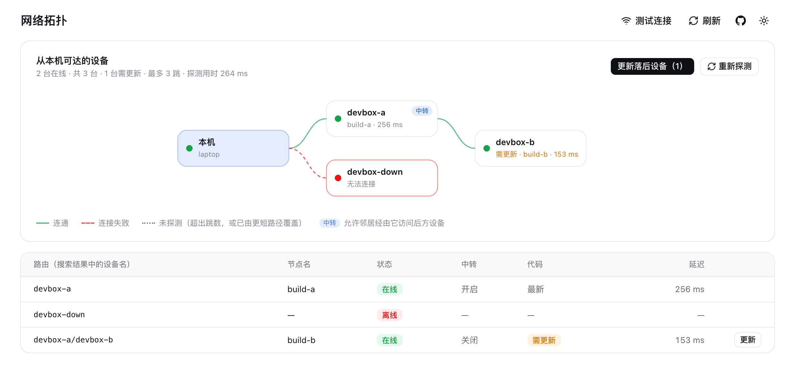

# Multi-device

Mnemo lets the agent on your laptop recall a session that ran on a devbox, and the other way around. It does this without a central server and without copying transcripts between machines.

## Design: message passing, not shared storage

> Don't communicate by sharing memory; share memory by communicating.

- **Each machine indexes only its own logs.** Every device has its own `~/.mnemo/index.db`.
- **A search is a message.** The query goes over SSH to every registered device in parallel. Each device searches locally and returns its ranked hits.
- **Results are merged by rank, not score.** BM25 scores from different corpora aren't comparable, so Mnemo merges them with Reciprocal Rank Fusion (`k = 60`).
- **Reads go to the data.** `context`, `session` and raw reads run on the device that holds the file. Only the messages you asked for travel back.

Adding a device means no data migration, and removing one leaves nothing behind on the other machines.

## Add a device

Requirements on the remote: passwordless SSH (keys or Kerberos/GSSAPI), `rsync`, and Python 3.7+ with SQLite FTS5.

```bash
mnemo remote add devbox-b                  # ssh host = name
mnemo remote add gpu-box user@10.0.0.12      # explicit ssh target
```

`remote add` does the following:

1. Checks connectivity.
2. Uses `rsync` to copy the Mnemo code to `~/mnemo/` on the remote. It excludes `.git`, caches and `index.db`.
3. Runs `mnemo index` there to build the remote index.
4. Registers the device in `~/.mnemo/remotes.json`.

Devices get new code from you, not from GitHub: see [Keeping devices up to date](#keeping-devices-up-to-date).

## Topologies: direct links and relays

Each device lists only its **direct neighbors** in `~/.mnemo/remotes.json`. A search asks every neighbor; a neighbor with forwarding enabled passes it on to its own neighbors, so devices you cannot reach directly are still found:

```text
laptop ──▶ devbox-a ──▶ devbox-b        laptop sees devbox-b as "devbox-a/devbox-b"
```

```bash
# on devbox-a: let neighbors search and read through this device
mnemo node --forward on
```

- **Routes as hosts.** Every hit carries its route from you, e.g. `devbox-a/devbox-b`. Pass it back as `--host` (or the MCP `host` field) and `context` / `session` reads travel the same path.
- **No loops, no duplicates.** Each device has a stable id (`mnemo node`). A forwarded search carries the ids already covered and a hop budget (3 by default), so cycles stop, and a device reached over several routes is reported once, via the shortest one.
- **Forwarding is opt-in per device** (`forward: off` by default). A relay decides for itself whether neighbors may reach what lies behind it; with it off, the device still answers for its own sessions.
- **Mixed versions.** A neighbor running an older mnemo is asked the old way (its own index only) and never relays.

Full mesh still works and needs no relays: run `remote add` on each device pointing at the others. Relays help when a device is only reachable through another; for links that only work one way, see the next section.

### In the dashboard

The **Topology** view maps what this device can reach: each device's route, name, relay policy and latency, with unreachable ones marked. It probes the same paths a search takes (only through relays, within the hop budget), so it never shows more than a search could reach. Relays report their neighbors' names, never their SSH targets.

<p align="center">
  
</p>

On the **Devices** page you can rename this device and switch its relay, and switch relaying on a direct neighbor over its SSH link. Turning a relay on asks for confirmation first.

## Links that only work one way

A laptop can usually SSH into its devboxes, but they cannot connect back to it. `mnemo link` lets them search it anyway, over a session the laptop opens:

```bash
# on the laptop
mnemo node --name laptop                                  # how the devbox will see this device
mnemo link devbox-a --allow-inbound --install           # run it now and at every login
mnemo link --list                                         # state of each link
mnemo link devbox-a --uninstall                         # revoke
```

`--install` runs the link as a per-user service: a launchd agent on macOS, a systemd user unit on Linux (`loginctl enable-linger` keeps it up without a login session), and elsewhere a background process until the next reboot. `mnemo upgrade` restarts installed links so they run the new code. Without `--install`, `mnemo link` runs in the foreground. The dashboard's device cards show each link's state and switch it on or off.

While it runs, devbox-a lists `laptop` as a neighbor and its searches (and its agents' searches) include the laptop's sessions; routes like `laptop` or `laptop/devbox-b` work for reads as usual. When the laptop sleeps or the link stops, the devbox's searches skip it silently; asking it for something explicitly says it is not linked. The link reconnects with backoff after network changes.

What the devbox can do over the link is fixed on the laptop side: search, context, session, status, node info and an incremental sync. It gets no shell, cannot rename the laptop, change its relay setting, push code to it or run anything else, and requests pass through the laptop's own relay policy like any neighbor's. On the devbox, the link is a Unix socket in `~/.mnemo/links/` that only its user can open. `--allow-inbound` is required because this does let anyone with that devbox account read the laptop's sessions.

`mnemo node` shows this device's name, id, forwarding and its neighbors; `mnemo node --name laptop` renames it.

## Keeping devices up to date

Every device knows a short fingerprint of the code it runs (`mnemo node` shows it), so the device you upgrade can tell which others are behind:

- **`mnemo upgrade`** (and re-running the installer) brings every reachable device that runs different code up to this code after upgrading the local index. Devices already current are left alone; unreachable ones are reported and skipped. `--no-remotes` turns this off.
- **`mnemo remote upgrade [<route> ...]`** does just that step, for every device or for the given routes.
- **Through relays.** A device you cannot reach directly is updated by the relay in front of it, which forwards its own (freshly updated) code. As with searches, this only happens through devices with forwarding on. Pushing code runs it on the target, so a relay extends that reach. It is the same reach its own SSH access already gives whoever controls it.
- **In the dashboard** the topology view marks devices that need an update, with a per-device **Update** button and one for all of them.

Updates happen only when you ask: there is no background auto-update changing files on other machines behind your back.

## Freshness and failure

- Before each federated search, every remote runs an incremental `mnemo index`. This takes well under a second when idle.
- SSH connections are multiplexed with `ControlMaster` (sockets in `~/.mnemo/ssh-<name>`, persisting 10 minutes), so only the first query pays the handshake.
- `ConnectTimeout` is 8 s and `BatchMode` is on. An unreachable or password-prompting device is skipped with a warning, and results from the other devices come back complete.
- The dashboard's device page shows per-device latency, index stats and a connectivity test; the topology view shows the whole reachable network.

## Kerberos notes

On hosts whose system `krb5.conf` lacks your corporate realm (a stock MIT config, for example), put a working config at `~/.krb5.conf`. Mnemo points its SSH calls at it automatically through `KRB5_CONFIG` when the file exists. Make sure you have a valid ticket (`klist`) before searching.

## Security model

- Mnemo opens no ports on remotes. Everything goes through your existing SSH trust.
- A remote returns only search hits and the messages you explicitly read. The full index and raw logs never leave it.
- Anyone who can SSH into a device can already read its logs, so direct links don't widen that boundary.
- Relays do: with `forward on`, a device lets its neighbors reach devices they have no SSH trust with. Enable it only on devices whose neighbors should see what lies behind them.
- So do inbound links, in the other direction: `mnemo link --allow-inbound` lets a device you can reach read your sessions (read-only commands only). Stop the link to revoke it.
